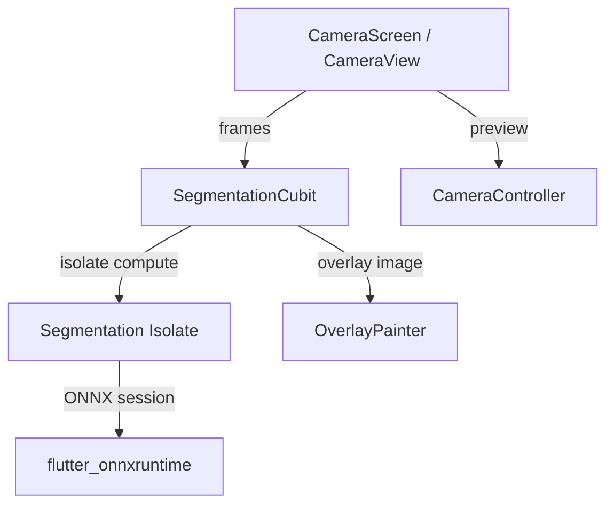

# Architecture

This fork keeps the upstream runtime flow intact and documents the main data path.

## Data flow summary
1. CameraController streams frames to CameraView.
2. SegmentationCubit throttles frames using frameSkipCount.
3. The isolate preprocesses frames and runs the ONNX session.
4. Similarity scores are thresholded to produce the overlay.
5. OverlayPainter renders the mask over the camera preview.

## Key modules
- lib/camera_screen.dart: UI, camera preview, and controls.
- lib/cubit/segmentation_cubit.dart: state orchestration and isolate calls.
- lib/segmentation_isolate.dart: preprocessing and ONNX inference.
- lib/constants.dart: runtime tuning constants.
